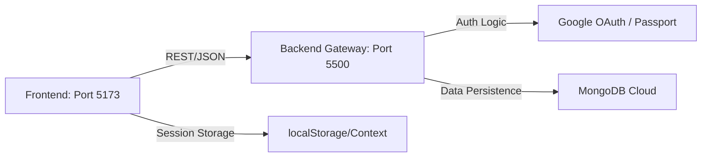

# NotesApp: Secure Full-Stack Workspace 🚀

A premium, full-stack note-taking platform built with the MERN stack, featuring advanced **Google OAuth 2.0** security, professional "Technical Architect" UI aesthetics, and enterprise-grade session integrity.

---

## 🌟 Key Feature Breakdown

### 🔐 Advanced Google OAuth 2.0 Integration
Managed via a robust **Passport.js** backend configuration. Unlike basic auth systems, our implementation ensures seamless user synchronization with MongoDB, handling profile updates and session serialization with high availability.

### 🛠️ Dual-Engine Workspace Architecture
Experience a versatile environment that caters to both casual browsers and authenticated power users:
- **Sandbox Mode**: A frontend-only `localStorage` playground for guests to test the workspace immediately without an account.
- **Production Engine**: A MongoDB-backed cloud workspace for authenticated users, providing persistent storage and cross-device accessibility.

### 🔄 Hydrated State & Session Persistence Loop
Custom **React Context** (UserContext) validation layers continuously monitor session health. Our intercepting state recovery logic catches and restores user profiles over explicit page refreshes by validating tokens against backend sanity-check routes, ensuring zero session drop-off.

### 🛡️ Granular Client-Side Route Guards
High-order `ProtectedRoute` components manage private workspace visibility. The system handles unauthorized access attempts with smooth redirects to authentication lanes, ensuring a secure boundary between public landing pages and private technical data.

---

## 💻 Tech Stack

| Layer | Technology |
|---|---|
| **Frontend** | React (Vite), Tailwind CSS, Lucide Icons |
| **Backend** | Node.js, Express.js, Passport.js |
| **Database** | MongoDB (Mongoose ODM) |
| **Styling** | Vanilla CSS + Tailwind v4 (Technical Architect Theme) |
| **API** | Axios (with session-aware interceptors) |
| **Security** | OAuth 2.0, JWT Session Management |

---

## 🏗️ Architectural Flow

The application splits responsibilities between two high-performance gateways:



- **Client**: React SPA communicating with backend endpoints for note management and profile hydration.
- **Server**: Node.js API acting as the central security and logic coordinator.

---

## 🚀 Installation & Local Setup

### 1. Clone the Repository
```bash
git clone https://github.com/KrishnaGhimire668/Authorization-MERN-project.git
cd Authorization-MERN-project
```

### 2. Install Dependencies
You must install dependencies for both layers:
```bash
# Install Backend dependencies
cd backend && npm install

# Install Frontend dependencies
cd ../frontend && npm install
```

### 3. Environment Configuration
Create a `.env` file in the **backend** directory:
```env
PORT=5500
MONGO_URI=your_mongodb_connection_string
GOOGLE_CLIENT_ID=your_google_client_id
GOOGLE_CLIENT_SECRET=your_google_client_secret
ACCESS_TOKEN_SECRET=your_jwt_secret
```

### 4. Running the Development Environment
Start both servers simultaneously:
```bash
# In /backend
npm start

# In /frontend
npm run dev
```

---

## 🎨 Design Philosophy: "The Technical Architect"
This project moves away from generic UI components. Every view leverages high-contrast emerald accents, glassmorphic backdrops, and interactive glowing borders to provide a professional, tool-like experience that feels like a developer's IDE for thoughts.
